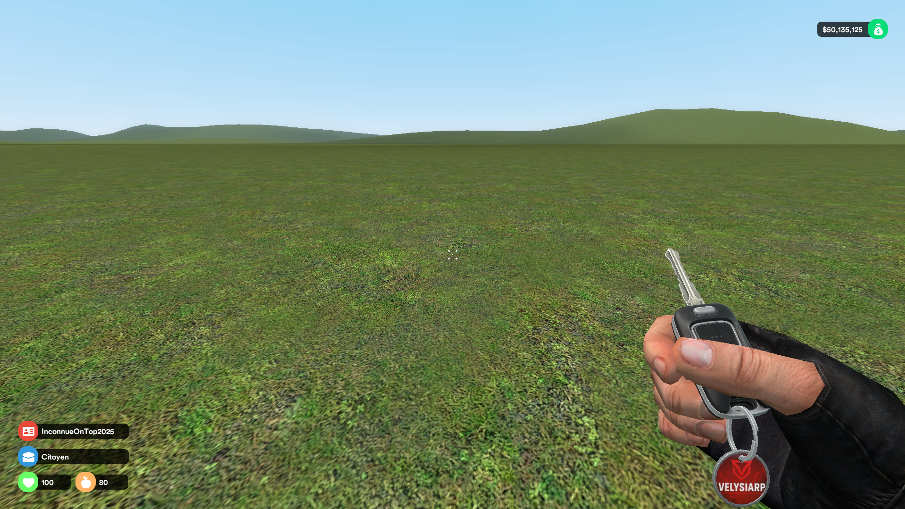

# 🧩 Addons — VelysiaRP

Ce dossier contient des captures d’écran des **ajouts fonctionnels** en jeu, spécifiques aux systèmes RP du serveur **VelysiaRP**.

📂 Ici, tu trouveras les visuels liés à :
- Les éléments placés dans la map (ATM, systèmes de portes, etc.)
- Les entités interactives (clés, garages, métiers, etc.)
- Les intégrations RP visuelles avec le logo ou l'identité de VelysiaRP

---

## 📸 Aperçu des Addons

| Système / Addon          | Capture d’écran               |
|--------------------------|-------------------------------|
| Logo sur ATM & Clés      |            |
| HUD VelysiaRP *(WIP)*    |     |
| Système Police Velysia   | *(à venir)*                   |
| Cardealer Velysia        |     |
| Système Maison / Porte   | *(à venir)*                   |

---

🛠️ Ce contenu est développé **exclusivement pour le serveur VelysiaRP**.  
📌 Les fichiers ici sont **des démonstrations visuelles** (aucun code partagé).

> Prochaine mise à jour : ajout des visuels pour Police & Maison.
