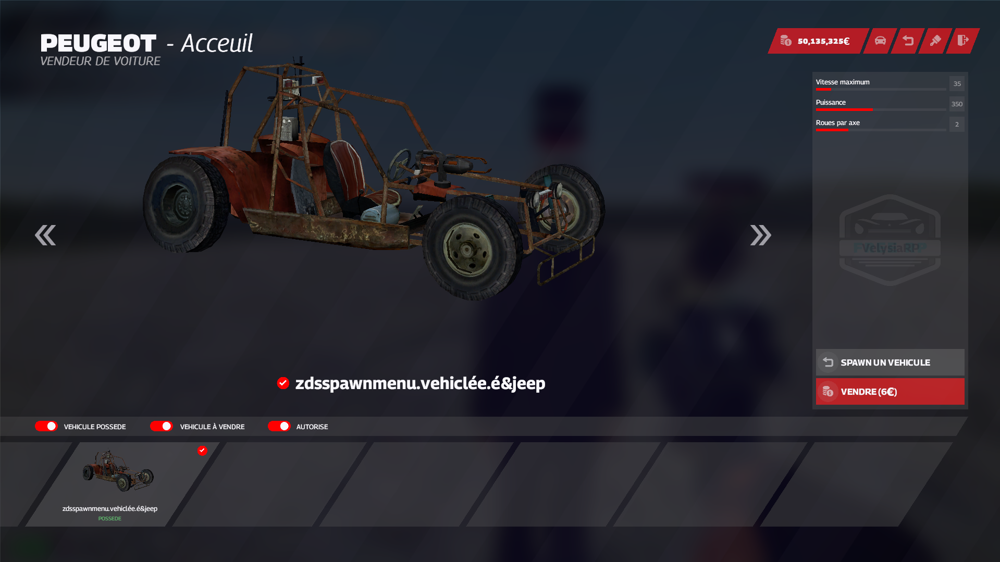
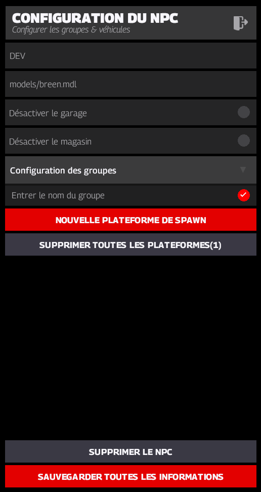
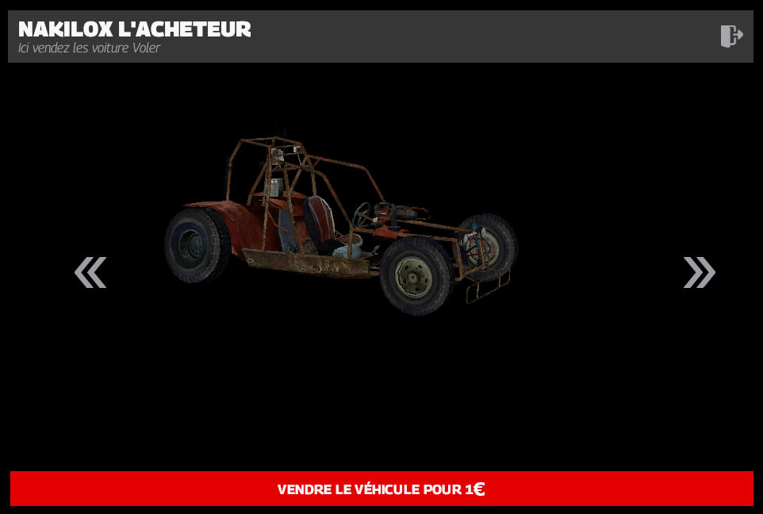
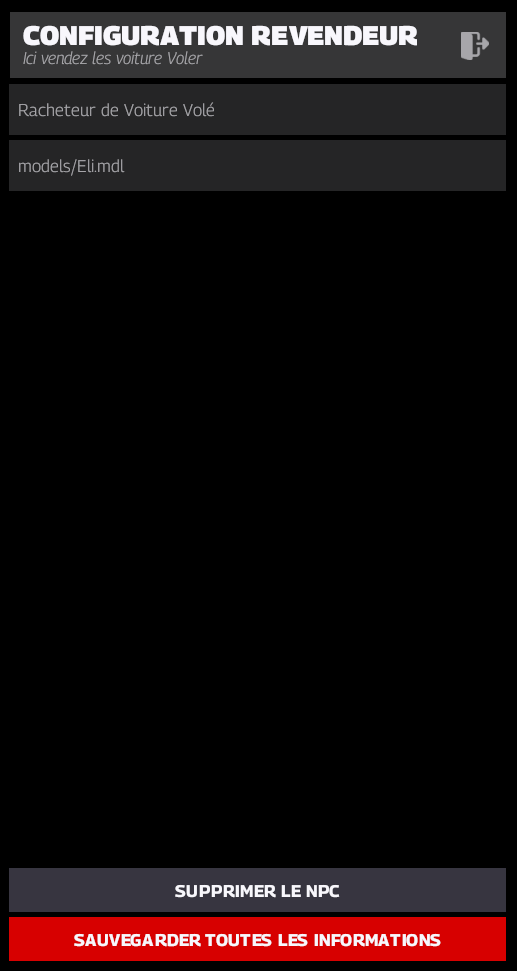
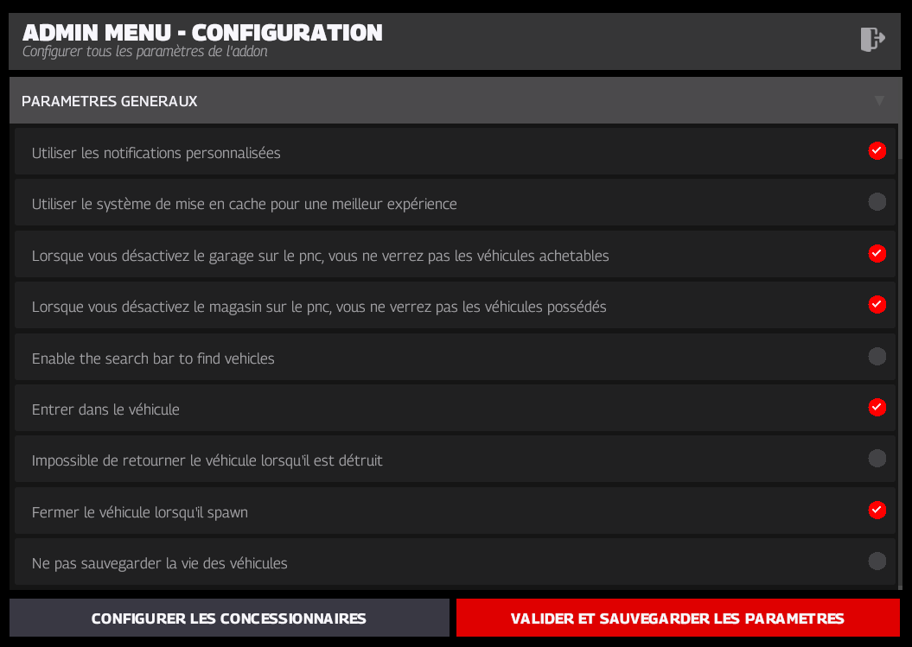
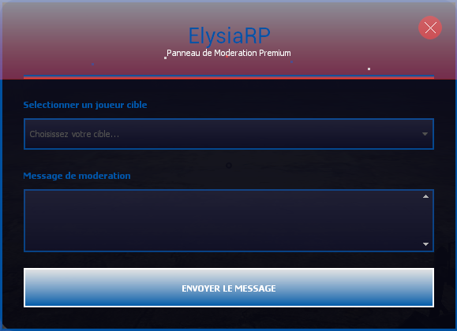
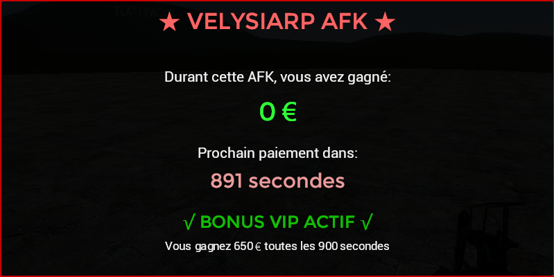

# 🎨 Interfaces Utilisateur (UI) — VelysiaRP

Ce dossier regroupe l’ensemble des interfaces personnalisées développées pour **VelysiaRP**.  
Chaque UI est pensée pour être claire, immersive et adaptée au gameplay RP du serveur.

---

## 🚗 Système Velysia_Cardealer

| Interface                             | Capture d’écran                         |
|---------------------------------------|------------------------------------------|
| Menu Principal (Achat / Vente / Garage / Custom) |          |
| Menu de configuration du Cardealer   |         |
| Menu Acheteur de voiture volée       |                   |
| Menu Config Acheteur de voiture volée|             |
| Menu **/rcd**                         |                     |

---

## 🛠️ Autres interfaces disponibles

| Interface                   | Capture d’écran               |
|----------------------------|-------------------------------|
| Menu Message Admin         |              |
| Menu Animation             |                  |
| Menu Warn                  |          |
| Système AFK                |           |

---

📌 **Note :**
- Les interfaces HUD et le système de Logo sont **en développement** et non encore disponibles publiquement.
- Toutes les UI présentes ici sont **en production** sur le serveur `VelysiaRP`.

> 📂 Ce dossier contient uniquement des **visuels de démonstration**. Aucun fichier LUA ou script partagé publiquement.
